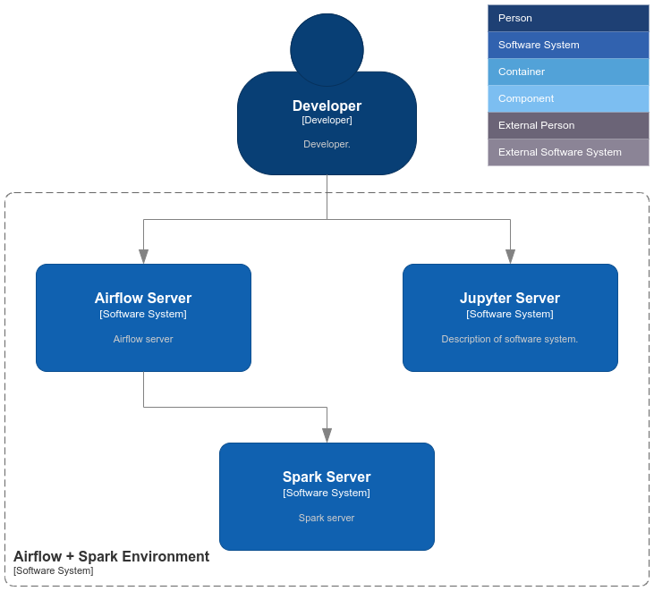
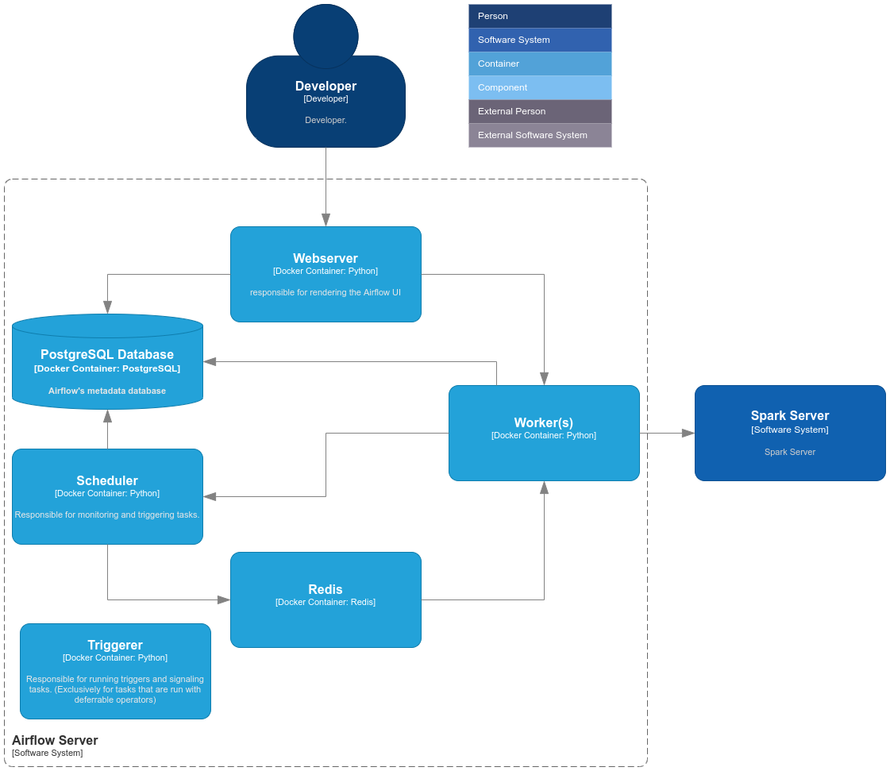
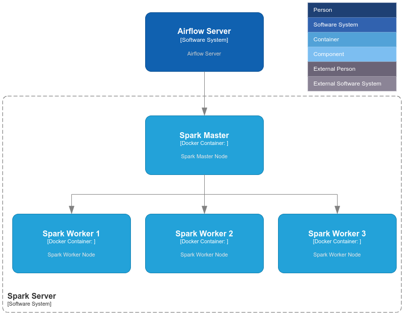

# docker-airflow-spark
This project aims to allow you to build a local airflow and spark environment for testing and development.

This project is not ready for a production environment.

To build this environment we will use docker, we will create several containers so we can build an airflow server that can request execution of spark scripts, a spark server and a jupyter notebook server so we can run scripts.
## Architecture

## Setup
On Linux, the quick-start needs to know your host user id and needs to have group id set to 0.

Otherwise the files created in dags, logs and plugins will be created with root user. You have to make sure to configure them for the docker-compose:

First create the directories

	mkdir -p ./dags ./logs ./plugins ./notebooks ./spark/app ./spark/resources/data ./spark/resources/jars

Next set the UID and GID in the .env file

	echo -e "AIRFLOW_UID=$(id -u)" > .env
    echo -e "AIRFLOW_GID=0" >> .env

On all operating systems, you need to run database migrations and create the first user account. To do it, run.

	docker-compose up airflow-init

After initialization is complete, you should see a message like below.

	airflow-init_1       | Upgrades done
	airflow-init_1       | Admin user airflow created
	airflow-init_1       | 2.3.3
	start_airflow-init_1 exited with code 0

The account created has the login *airflow* and the password *airflow*, this can be changed by adding the following variables to the .env file:

	_AIRFLOW_WWW_USER_USERNAME
	_AIRFLOW_WWW_USER_PASSWORD

## Running Airflow

Now you can start all services:

	docker-compose up

After the first startup you need to set up the Spark connection, navigate to the connection page in the airflow UI (Admin > Connections) and add the following connection

	Connection Id: spark_default
	Connection Type: Spark
	Host: spark://spark
	Port: 7077
	Extra: {"queue": "root.default"}

## Cleaning up

To stop and delete containers, delete volumes with database data and download images, run:

	docker-compose down --volumes --rmi all

## How to use

URLs to access the UIs

- Spark Master: http://localhost:8181
- Airflow: http://localhost:8080
- Jupyter Notebook: http://127.0.0.1:8888/lab

You need to run the code below to get the URL + Token generated and paste in your browser to access the jupyter notebook UI.

    docker logs -f jupyter-container-name

It is also recommended to install the Visual Studio Code Jupyter extension, which allows you to create notebooks and run them in the Jupyter server from Visual Studio Code.

To do this first install the extension, then open the command palette and find the following option.

Then insert the URI with the token http://127.0.0.1:8888/?token={token}, after that you can create a jupyter notebook inside the ./notebooks folder, open it and select the remote server by clicking on the button on the bottom right.

Now you can import Spark library into notebook and have fun.