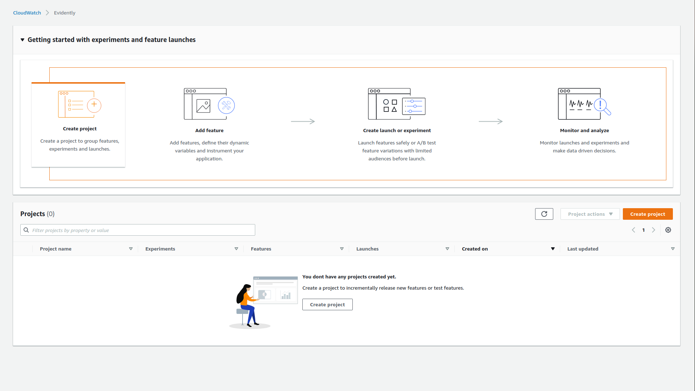
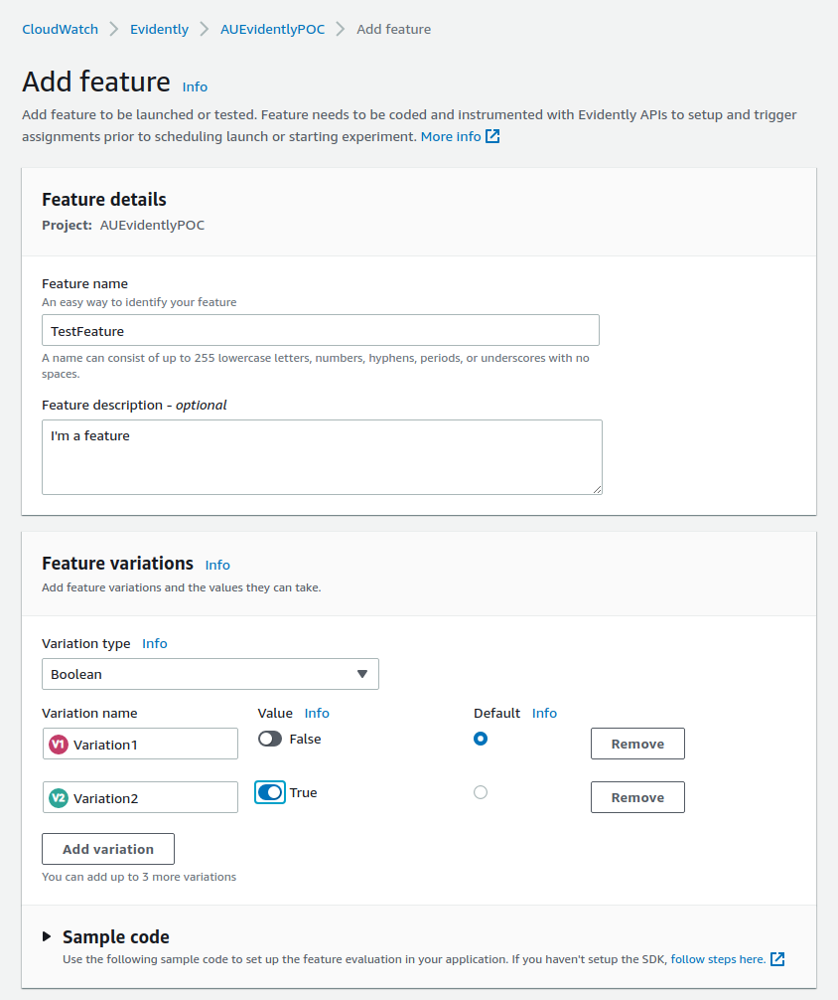
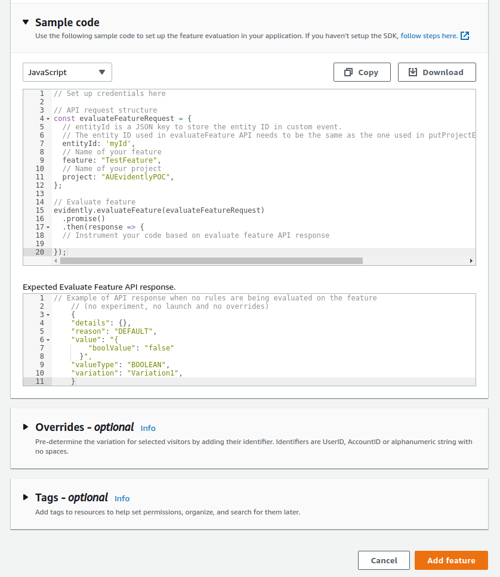
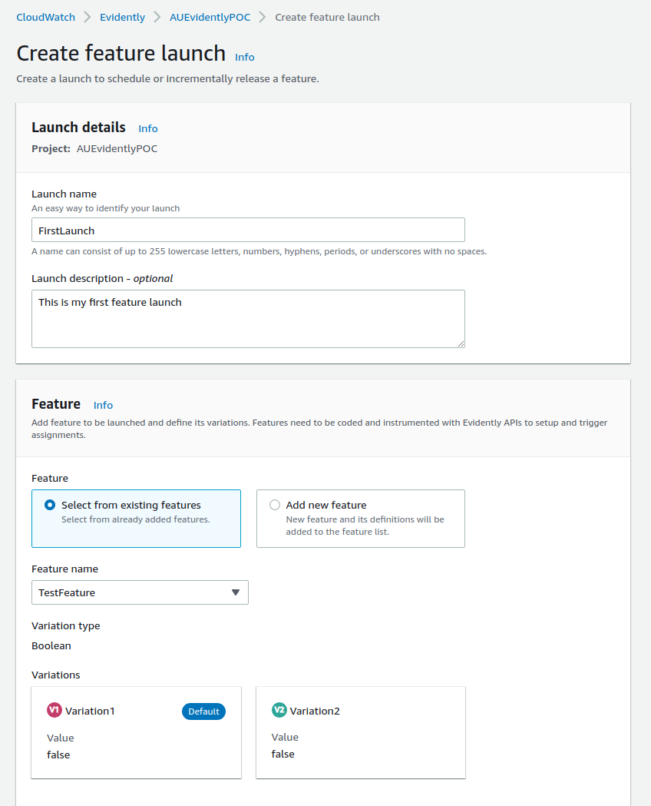
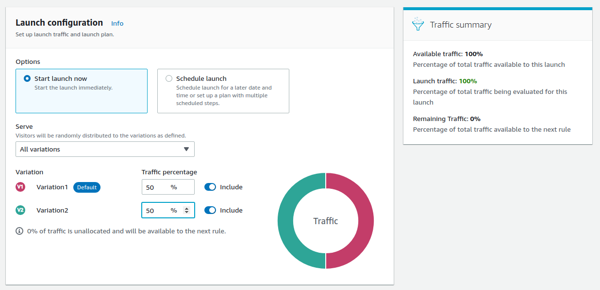
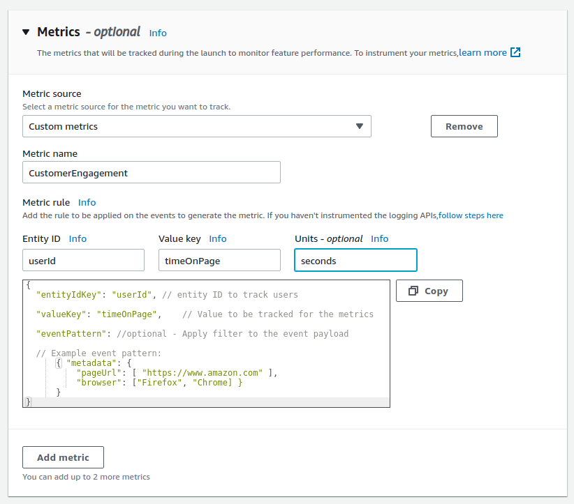
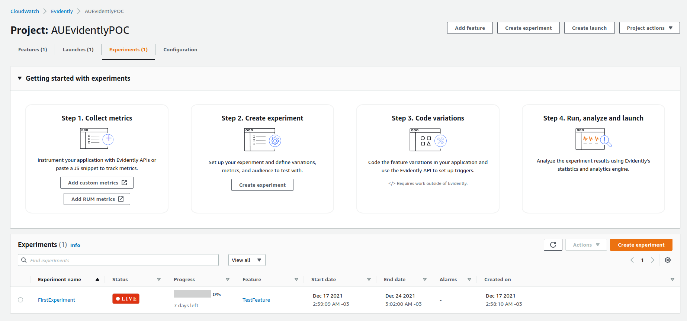
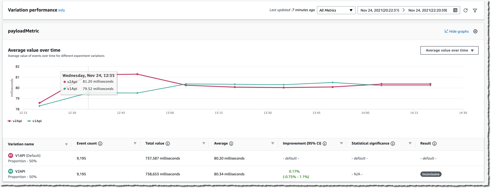

# Proof of Concept: Backend Application with Node.js

We created on Proof of Concept on how to integrate the service with a [Backend Application with Node.js](./POC.md).
This POC was created in less than 20 minutes. It is a simple application that has a feature that is enabled or disabled based on the variation that the user is assigned to. Also provides a simple experiment that is used to test the service and some images that are displayed based on the variation that the user is assigned to.

- [Proof of Concept: Backend Application with Node.js](#proof-of-concept-backend-application-with-nodejs)
  - [Introduction](#introduction)
  - [Create a new Project](#create-a-new-project)
  - [Add a Feature](#add-a-feature)
  - [Instrument our Application Code](#instrument-our-application-code)
  - [Create a Launch](#create-a-launch)
  - [A/B Testing](#ab-testing)

## Introduction

In this POC we create a new Project on CloudWatch Evidently, with a Feature, a Launch and Experiment. Also we provide some example code to access the feature variant using `aws-sdk` for NodeJS.

You can check a full explanation of this here: [https://aws.amazon.com/blogs/aws/cloudwatch-evidently/](https://aws.amazon.com/blogs/aws/cloudwatch-evidently/)

This POC is just the result we got following that guide and developing the feature request myself on the cloud.

## Create a new Project

Let’s start by configuring Evidently. We open the AWS Management Console and navigate to **CloudWatch Evidently**. Then, we select **Create a project**.

.

We enter a **Project name** and Description.

Evidently lets you optionally store events to CloudWatch logs or S3, so that you can move them to systems such as [Amazon Redshift](https://aws.amazon.com/redshift/) to perform analytical operations. For this POC, we choose not to store events. When done, we select **Create project**.

.

## Add a Feature

Next, we create a feature for this project by selecting **Add feature**. we enter a **Feature name** and **Feature description**. Next, we define our **Feature variations.** In this example, there are two variations, and we use a Boolean type. `true` indicates the feature _TestFeature_ is ON and `false` indicates it is OFF. Variations types might be `boolean`, `double`, `long`, or `string`.

.

.

## Instrument our Application Code

For this we just created one small script that uses the aws js sdk to use consume the feature we just created.

- [`package.json`](./poc/package.json)

```json
{
  "dependencies": {
    "@aws-sdk/client-evidently": "^3.44.0",
    "aws-sdk": "^2.1046.0",
    "node-uuid": ">= 1.4.1"
  }
}
```

- [`sample.js`](./poc/sample.js)

```js
const { Evidently } = require("@aws-sdk/client-evidently");
const uuid = require("node-uuid");

// Create an Evidently client
const evidently = new Evidently({ region: "us-west-2" });

// Create a new entity id. For example, we can use the flashId here
const id = uuid.v4();

// API request structure
const evaluateFeatureRequest = {
  // entityId for calling evaluate feature API
  entityId: id,
  // Name of your feature
  feature: "TestFeature",
  // Name of your project
  project: "AUEvidentlyPOC",
};

// Evaluate feature
evidently.evaluateFeature(evaluateFeatureRequest).then((response) => {
  // Instrument your code based on evaluate feature API response
  console.log(response);
});
```

You can just create both file in the same directory and run the following command:

```bash
npm install
node ./sample.js
```

The response we get is something like this:

```js
{
  '$metadata': {
    httpStatusCode: 200,
    requestId: 'd56a34b4-9065-4449-9991-931639be20ef',
    extendedRequestId: undefined,
    cfId: undefined,
    attempts: 1,
    totalRetryDelay: 0
  },
  details: [String (LazyJsonString): '{}'],
  reason: 'DEFAULT',
  value: { boolValue: false },
  variation: 'Variation1'
}
```

## Create a Launch

Now that the feature is defined on the server-side, and the client code is instrumented, we deploy the code and expose it to our customers. At a later stage, we may decide to launch the feature. We navigate back to the console, select our project, and select **Create Launch**. we choose a **Launch name** and a **Launch description** for our launch. Then, we **select** the feature we want to launch.

.

In the **Launch Configuration** section, we configure how much traffic is sent to each variation. We may also schedule the launch with multiple steps. This lets me plan different steps of routing based on a schedule. For example, on the first day, we may choose to send 10% of the traffic to the new feature, and on the second day 20%, etc. In this example, we decide to split the traffic 50/50.

.

Finally, we may define up to three metrics to measure the performance of our variations. Metrics are defined by applying rules to data events.

.

Again, we have to instrument our code to send these metrics with `PutProjectEvents` API from Evidently. Once our launch is created, the `EvaluateFeature` API returns different values for different values of `entityId` (users in this demo).

At any moment, we may change the routing configuration. Moreover, we also have access to a monitoring dashboard to observe the distribution of our variations and the metrics for each variation.

.

## A/B Testing

Doing an A/B test is similar. We create a feature to test, and we create an **Experiment**. we configure the experiment to route part of the traffic to variation 1, and then the other part to variation 2. When we am ready to launch the experiment, we explicitly select **Start experiment**.

.

To put events we use a code like the following:

- [`abtest.js`](./poc/abtest.js)

```js
const { Evidently } = require("@aws-sdk/client-evidently");
const uuid = require("node-uuid");

// Create an Evidently client
const evidently = new Evidently({ region: "us-west-2" });

// Create a new entity id. For example, we can use the flashId here
const id = uuid.v4();

// pageLoadTime custom metric
const timeSpendOnHomePageData = `{
  "details": {
    "timeOnPage": 10
  },
  "userDetails": { "userId": "${id}", "sessionId": "${id}" }
}`;

const yesterday = new Date();

yesterday.setDate(yesterday.getDate() - 1);

const putProjectEventsRequest = {
  project: "AUEvidentlyPOC",
  events: [
    {
      timestamp: yesterday,
      type: "aws.evidently.custom",
      data: JSON.parse(timeSpendOnHomePageData),
    },
  ],
};

evidently.putProjectEvents(putProjectEventsRequest).then((res) => {
  console.log(res);
});
```

Switching to the **Results** page, we see raw values and graph data for **Event Count**, **Total Value**, **Average**, **Improvement** (with 95% [confidence interval](https://en.wikipedia.org/wiki/Confidence_interval)), and **Statistical significance**. The statistical significance describes how certain we are that the variation has an effect on the metric as compared to the baseline.

These results are generated throughout the experiment and the confidence intervals and the statistical significance are guaranteed to be valid anytime you want to view them. Additionally, at the end of the experiment, Evidently also generates a Bayesian perspective of the experiment that provides information about how likely it is that a difference between the variations exists.

The following two screenshots show graphs for the average value of two metrics over time, and the improvement for a metric within a 95% confidence interval.

.

.
